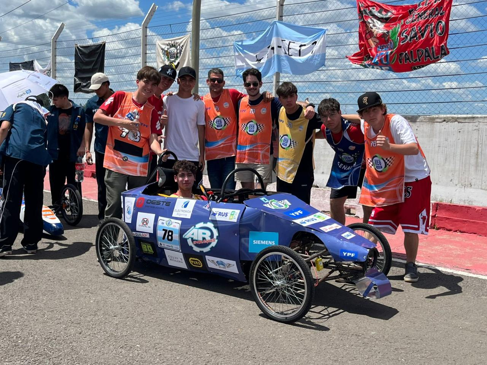
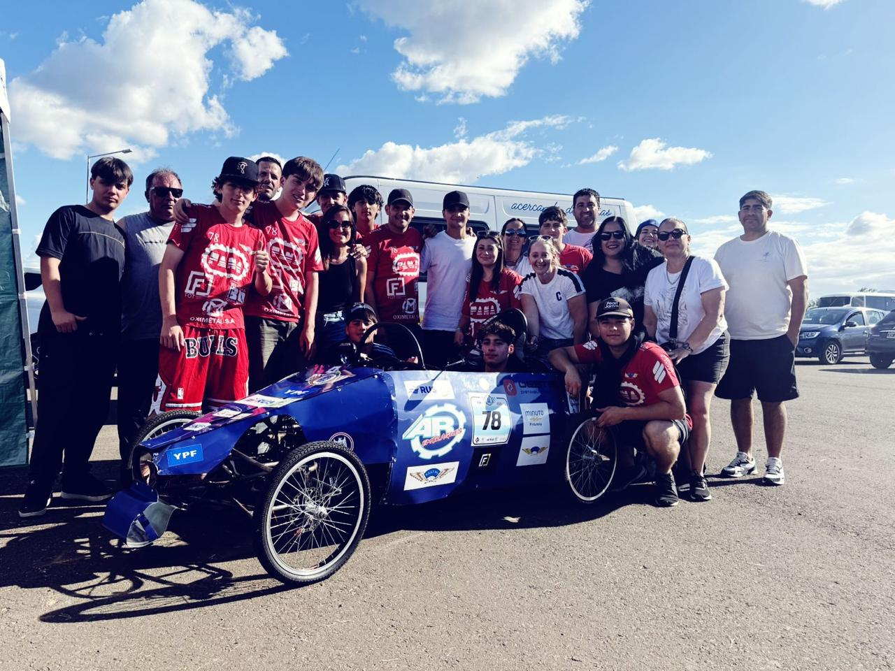

# PROYECTO YPF

## El proyecto original tenía como objetivo desarrollar la Computadora del Auto completa para el Desafío ECO YPF, incorporando diversos módulos de control y adquisición de datos para asistir al piloto. Dentro del conjunto de la Computadora, el Sistema de Control de Velocidad Crucero representaba solo una de las funcionalidades planificadas.
Sin embargo, durante el proceso surgieron diversos imprevistos que modificaron el alcance del proyecto. El viaje al autódromo, condiciones climáticas de tormenta que impidieron trabajar sobre el vehículo y, finalmente, un choque que dañó la placa principal del auto, imposibilitaron continuar con la integración de la computadora completa. Como consecuencia, se decidió enfocar el proyecto al desarrollo y funcionamiento del sistema de velocidad crucero utilizando una placa experimental.
Esta reestructuración permitió concentrarse en el diseño, programación y prueba del sistema decontrol de velocidad mediante ESP32, GPS y servomotor, con un sistema PID. Aunque no fue posible implementar la computadora entera del vehículo, el repositorio oficial del proyecto incluye el código completo de todos los módulos de la computadora, documentado y accesible.
En este informe se detalla el funcionamiento del sistema de velocidad crucero, su implementación, las pruebas realizadas y los resultados obtenidos en función del ensayo con la placa experimental.

